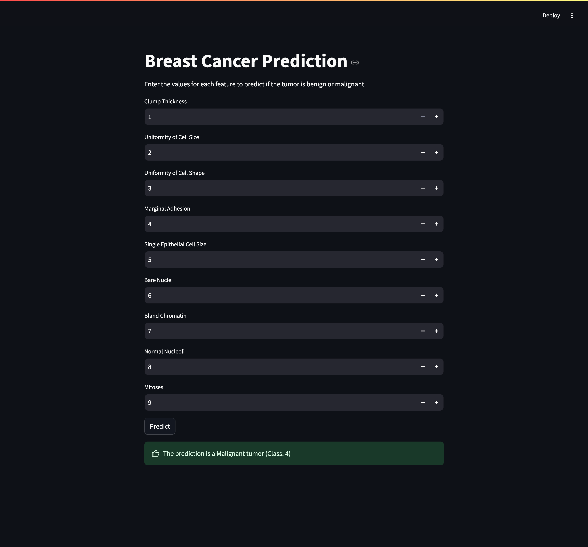

# Breast Cancer Prediction App (Streamlit)

# Breast Cancer Prediction
This project provides a Streamlit application for users to input tumor feature values and receive predictions from the FastAPI backend.

## Table of Contents
- [Description](#description)
- [Requirements](#requirements)
- [Getting Started](#getting-started)
- [Usage](#usage)
- [Example Input and Output](#example-input-and-output)
- [File Structure](#file-structure)
- [License](#license)

## Description

The Streamlit application provides an interactive web interface for predicting breast cancer tumor types using a Logistic Regression model served by a FastAPI backend. The following features are input values expected from users:

- Clump Thickness
- Uniformity of Cell Size
- Uniformity of Cell Shape
- Marginal Adhesion
- Single Epithelial Cell Size
- Bare Nuclei
- Bland Chromatin
- Normal Nucleoli
- Mitoses


## Requirements
To set up and run this project, you’ll need the following Python packages:

- `scikit-learn`
- `pandas`
- `joblib`
- `numpy`
- `streamlit`

You can install these dependencies by running:
```bash
pip install -r requirements.txt
```

## Getting Started
Follow these steps to set up and run the project.

1. Ensure the FastAPI server is running on `http://127.0.0.1:8000`
2. Declare the `base_url` to your API in the `.env` file e.g. `BASE_URL=http://127.0.0.1:8000`
3. Run Streamlit
The Streamlit app allows users to input values and retrieve predictions from the FastAPI server. To start Streamlit, run:
  ```bash
  streamlit run app.py
  ``` 
The Streamlit app will open in a browser window at `http://localhost:8501`.

## Usage

Streamlit Frontend


- Input tumor features in the provided fields. 
- Click the Predict button to get the prediction. 
- The prediction will display whether the tumor is benign (2) or malignant (4).
  
### Streamlit Application

The Streamlit app provides an interface for users to input feature values and get predictions. When the Predict button is clicked, the app sends the data to the FastAPI server and displays whether the tumor is benign or malignant.

## Example Input and Output
Example Input:

Clump Thickness = 5  
Uniformity of Cell Size = 3  
Uniformity of Cell Shape = 3  
Marginal Adhesion = 2  
Single Epithelial Cell Size = 3  
Bare Nuclei = 4  
Bland Chromatin = 3  
Normal Nucleoli = 2  
Mitoses = 1 

Example Output:

Prediction: 2  
Label: Benign 


## File Structure
The project directory is structured as follows:

```
📦 logistic_regression_classifier_frontend
├─ src
├─ .env
├─ .gitignore
├─ app.py
├─ README.md
└─ requirements.txt
```
## License
This project is licensed under [](https://opensource.org/licenses/MIT)